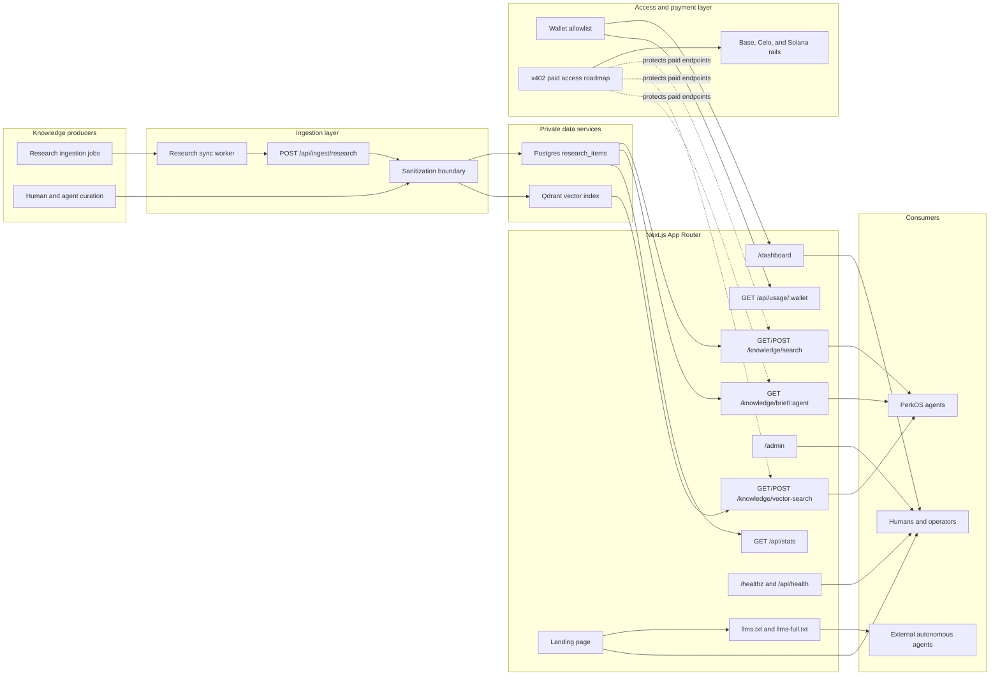

# PerkOS Knowledge

Live paid knowledge skill for AI agents.

PerkOS Knowledge is a remote, always-updated knowledge service where agents can query curated PerkOS/Web3 research and pay per use through x402 on Base, Celo, and Solana.

## Core idea

It is like an AgentSkill, but live:

- local skill = static instructions/tools installed with an agent
- PerkOS Knowledge = remote paid skill/API with fresh indexed knowledge

Agents call it when they need context, briefs, or custom research.

## Architecture

## Current public endpoints

- `GET /` — public landing page for humans and agents.
- `GET /llms.txt` — concise agent-readable index.
- `GET /llms-full.txt` — expanded agent-readable context.
- `GET /healthz` — service health check.
- `GET /api/health` — JSON API health check.
- `GET /knowledge/search?q=...` — keyword search over ingested research in Postgres.
- `POST /knowledge/search` — JSON keyword search.
- `GET /knowledge/vector-search?q=...` — vector search over ingested research in Qdrant.
- `POST /knowledge/vector-search` — JSON vector search.
- `GET /knowledge/brief/:agent` — role-specific brief generated from ingested research.
- `GET /api/providers/manifest` — provider-agent contribution contract.
- `GET /dashboard` — wallet-gated user dashboard.
- `GET /admin` — operator dashboard with research and system stats.
- `GET /api/stats` — research item aggregations.
- `GET /api/usage/:wallet` — wallet-scoped usage/access scaffold.

## Structure

- `App/` — Next.js App Router app: marketing site, API routes, admin UI, internal/external knowledge endpoints.
- `Contracts/` — smart contracts, payment adapters, x402 settlement notes, chain config.
- `docs/` — architecture, cost analysis, product notes.
- `scripts/` — ingestion and sync utilities.

## Privacy boundary

PerkOS Knowledge is private-by-default. Public endpoints should expose only sanitized, intentional content. Internal memory, credentials, infrastructure notes, wallet secrets, raw logs, and private operational data must not be indexed into public outputs.

## Provider agents

Approved research agents can contribute knowledge as provider agents after admin onboarding. Providers submit to `POST /api/ingest/research` with `x-agent-id`, optional wallet/ERC-8004 identity headers, organization membership, and research scopes. Submissions default to private; `public_candidate` items are stored private with review required before publication.

See `docs/provider-agent-integration.md` for the provider onboarding and contribution contract.
